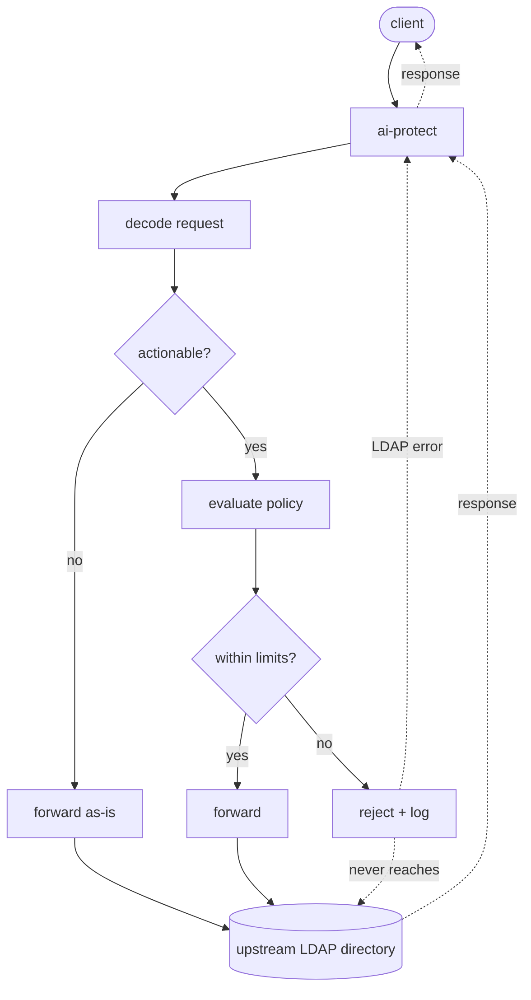

# ai-protect

A transparent proxy for directory services (LDAP today) that blocks
bulk, high-blast-radius account operations — like an automated agent or
runaway script locking thousands of accounts — before they reach the real
directory.

It sits inline between clients and the upstream directory server. Requests
it doesn't need to act on are forwarded byte-for-byte, untouched. Requests
that modify account-lock attributes, delete, create, or rename/move an
entry outright, or reset a password via extended operation are checked
against configurable blast-radius policies and either forwarded or
rejected with a proper LDAP error, with every decision logged. Each hop
(client-facing and upstream) can independently run plaintext LDAP or
LDAPS.

> **Status:** early. TOML-based config and policy files, TLS on both hops
> (including optional mutual TLS and RFC 4511 StartTLS), bounded concurrent
> connections with per-I/O timeouts, graceful shutdown on SIGTERM/SIGINT,
> policy-file hot-reload on SIGHUP, Prometheus metrics, a liveness/readiness
> endpoint, a unit + end-to-end test suite, and CI all exist. See
> [ARCHITECTURE.md](ARCHITECTURE.md) for the full design and
> [TODO.md](TODO.md) for the gap list to a production-ready deployment.

## How it works

```
client  ---->  ai-protect  ---->  upstream LDAP directory
                   |
                   +-- decode request
                   +-- not actionable?        forward as-is
                   +-- actionable -> evaluate policy
                         +-- within limits -> forward
                         +-- over limit    -> reject, log, never reaches directory

client  <----  ai-protect  <----  upstream LDAP directory
                   |
                   +-- allowed request's response relayed back untouched
                   +-- blocked request never reaches upstream;
                       ai-protect answers directly with an LDAP error
```



Every modify request is inspected for attributes that represent an
account lock across common directory schemas (Active Directory,
OpenLDAP, 389 DS); every delete, add, or modify-DN (rename/move) request
is treated as actionable unconditionally, since removing, creating, or
renaming/moving an entry outright is already high-blast-radius; and a
password-reset extended operation (RFC 3062) is treated the same way,
since a bulk reset locks users out just as a bulk lock would. Matching
requests are checked against the configured policy chain — currently a
threshold policy that blocks:

- any single request whose blast radius exceeds a per-request cap, and
- any identity whose cumulative blast radius within a sliding time window
  exceeds a window cap

See [ARCHITECTURE.md](ARCHITECTURE.md) for the full request lifecycle and
component design.

## Requirements

- Rust (2024 edition toolchain)
- An LDAP-speaking directory to proxy to (for local testing, `docker
  compose` brings up a disposable [lldap](https://github.com/lldap/lldap)
  instance — see [Local testing](#local-testing) below)

## Building

```sh
cargo build
```

## Configuration

`ai-protect` needs a process config file and a policy file, neither of
which is tracked in git (real deployment values may be sensitive). Copy
the tracked templates to get started:

```sh
cp config.example.toml config.toml
cp policies/ldap.example.toml policies/ldap.toml
```

Or run [`./setup.sh`](setup.sh) instead: it interrogates the real upstream
directory server (rootDSE, TLS certificate — read-only, nothing is
modified) and interactively writes both files tailored to what it finds,
rather than starting from placeholder values.

- `config.toml` (schema in [config.example.toml](config.example.toml)) —
  one or more `[[proxy]]` entries, each with its own listen address and one
  or more upstream addresses (load-balanced across them if more than one —
  round-robin, random, or least-connections, configurable, with automatic
  failover and passive health tracking — see `config.example.toml`),
  optional `[proxy.listen_tls]` / `[proxy.upstream_tls]` tables to enable
  LDAPS on either hop, and its own policy file — a single process can front
  more than one directory or listen address this way.
- `policies/ldap.toml` (schema in
  [policies/ldap.example.toml](policies/ldap.example.toml)) — an ordered
  list of `[[policy]]` tables. The only type today is `"threshold"`
  (`max_per_request`, `max_per_window`, `window_secs`), plus an optional
  `state_db` and `flush_interval_secs` if you want its history to survive a
  restart or be approximately shared across multiple `ai-protect`
  instances: either a SQLite file path (single-instance restart durability,
  or sharing across instances with a shared disk/volume) or a
  `{ url = "redis://...", key_prefix = "..." }` table naming a
  Valkey/Redis-protocol server (sharing across hosts with no shared disk —
  a local one is available via `docker compose --profile ha up -d valkey`)
  — see [ARCHITECTURE.md](ARCHITECTURE.md#sqlite-backed-policy-state).

Both files are gitignored (see [.gitignore](.gitignore)); `ai-protect`
fails fast with a message pointing at the matching example file if either
is missing.

Optionally, add a top-level `[metrics]` table to `config.toml` (commented
out in the example) to serve Prometheus metrics — connection counts,
policy allow/block rates, upstream connect latency, and TLS handshake
failures — over plain HTTP at `/metrics` on `listen_addr`. One endpoint
covers every `[[proxy]]` entry; absent by default.

Optionally, add a top-level `[health]` table (also commented out in the
example) to serve `/healthz` (liveness) and `/readyz` (readiness) on
`listen_addr`, for orchestrator probes (k8s `livenessProbe`/`readinessProbe`,
or equivalent). `/readyz` flips to `503` as soon as graceful shutdown is
requested, ahead of the drain itself finishing; `/healthz` stays `200`
throughout the drain so a liveness probe doesn't get the process killed
mid-shutdown. One endpoint covers every `[[proxy]]` entry; absent by
default.

## Running

```sh
cargo run                        # loads ./config.toml
cargo run -- other-config.toml   # load config from a different path
```

With the example config, this listens on `127.0.0.1:3890` and proxies to
an upstream LDAP server on `127.0.0.1:389`, blocking any single request
with blast radius over `10` and any identity exceeding `50` cumulative
blast radius in a `60s` window. Point an LDAP client at `127.0.0.1:3890`
instead of the real directory to exercise it.

Logging is off by default; enable it with `RUST_LOG`:

```sh
RUST_LOG=info cargo run
```

When enabled, every log line goes to both stdout (human-readable) and
`./logs/ldap.log` (structured JSON, fields flattened to the top level) —
the latter is what to point a log shipper or SIEM at. See "Audit logging"
in [ARCHITECTURE.md](ARCHITECTURE.md#audit-logging).

### Docker

[docker/rust/Dockerfile](docker/rust/Dockerfile) builds the release binary
in one stage and copies it into a minimal Debian runtime image in another.
`config.toml`/`policies/*.toml`/`certs/` are deliberately not baked into the
image (they're gitignored — see [Configuration](#configuration)) — mount
them in at runtime instead:

```sh
docker build -f docker/rust/Dockerfile -t ai-protect .
docker run --rm \
  -p 3890:3890 \
  -v "$PWD/config.toml:/app/config.toml:ro" \
  -v "$PWD/policies:/app/policies:ro" \
  ai-protect
```

The container runs as an unprivileged user and writes `./logs` relative to
its `/app` working directory, same as running the binary directly.

## Local testing

[compose.yaml](compose.yaml) runs a disposable
[lldap](https://github.com/lldap/lldap) directory as a stand-in upstream:

```sh
cp .env.example .env   # fill in real secrets, see comments in the file
docker compose up -d lldap
```

[test.sh](test.sh) is a full end-to-end test: it brings up that container,
builds and runs the real `ai-protect` binary in front of it, and drives
both through the proxy and directly upstream with the system
`ldapsearch`/`ldapmodify`/`ldapwhoami`/`ldappasswd` tools to confirm
pass-through, per-request blocking, and sliding-window blocking all work
over the wire, with every decision landing in the audit log. Requires
`docker` (compose), `cargo`, and the OpenLDAP client tools.

```sh
./test.sh
```

## Fuzzing

[fuzz/](fuzz/) is a [`cargo-fuzz`](https://github.com/rust-fuzz/cargo-fuzz)
project targeting the two places
[`LdapConnector`](src/connector/ldap.rs) touches fully untrusted bytes off
the wire: `read_frame`'s BER tag/length framing, and the
`decode`/`upgrade_request`/`bind_request`/`bind_response`/`build_rejection` methods that
`rasn::ber::decode` a length-delimited frame into an LDAP message. Requires
a nightly toolchain (`rustup toolchain install nightly`) and `cargo install
cargo-fuzz`.

```sh
cargo +nightly fuzz run decode       # BER message decoding
cargo +nightly fuzz run read_frame   # frame length parsing
```

Each runs indefinitely until stopped (`Ctrl-C`) or a crash is found (saved
under `fuzz/artifacts/`); pass `-- -max_total_time=60` to bound a run, e.g.
for a quick local check.

## Load/soak testing

[soak.sh](soak.sh) drives the real release binary the same way
[test.sh](test.sh) does, but with many concurrent, sustained connections
instead of a handful of correctness checks — the two things a unit/e2e
suite can't catch: a memory or file-descriptor leak, or the connection
Semaphore not actually shedding load. It runs a pool of concurrent workers
against ai-protect for a sustained duration while sampling its RSS and
open-fd count, then checks memory and fd count both settle back down and
`ai_protect_connections_active` returns to `0` once load stops; then bursts
far more concurrent connection attempts than a low `max_connections` cap to
confirm the excess is rejected immediately instead of queued/hung. Requires
the same tools as `test.sh` plus `curl`.

```sh
./soak.sh
DURATION_SECS=60 CONCURRENCY=200 BURST_CONCURRENCY=1000 ./soak.sh   # heavier run
```

Not part of `cargo test` or CI — run manually, e.g. after touching
`src/proxy.rs`, connection limits, or the metrics/health modules.

## Development

```sh
cargo check    # type/borrow check
cargo fmt      # format
cargo clippy   # lint
cargo test     # unit + in-process integration tests
./test.sh      # real end-to-end test against a live LDAP server
./soak.sh      # load/soak test against a live LDAP server
```

CI ([.github/workflows/ci.yaml](.github/workflows/ci.yaml)) runs `cargo
build`/`cargo test` on stable, beta, and nightly, `cargo fmt --check`/
`cargo clippy -D warnings` on stable, and a `cargo audit` supply-chain scan
against the RustSec advisory database — all on every push and PR.

## Documentation

- [docs/README.md](docs/README.md) — end-user documentation: what
  ai-protect does, how to install and configure it, and how its LDAP
  policy behaves in practice
- [AGENTS.md](AGENTS.md) — module map and conventions for anyone (human or
  agent) working on this codebase
- [ARCHITECTURE.md](ARCHITECTURE.md) — system design, request lifecycle,
  extension points, and known gaps
- [TODO.md](TODO.md) — gap list between the current state and a
  production-ready deployment
